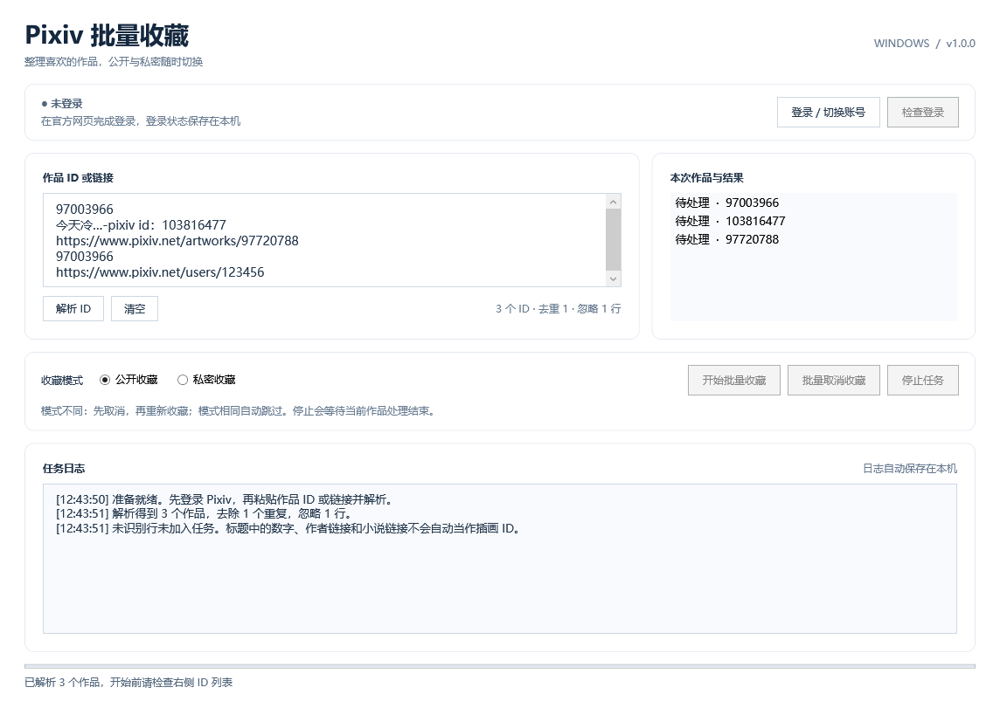

# Pixiv 批量收藏工具 Windows v1.0.0

中文 WPF 桌面工具，按 Android v0.1.5 的已确认规则重新实现。支持插画、漫画和动图的作品 ID。

## 下载

- [Windows x64 便携包（完整解压后运行）](https://github.com/37f/PixivBatchBookmark-Windows/releases/download/v1.0.0/PixivBatchBookmark_Windows_v1.0.0_win-x64.zip)
- [完整源码与构建脚本](https://github.com/37f/PixivBatchBookmark-Windows/releases/download/v1.0.0/PixivBatchBookmark_Windows_v1.0.0_source.zip)
- [版本说明和校验文件](https://github.com/37f/PixivBatchBookmark-Windows/releases/tag/v1.0.0)



## 已实现功能

- 内置 WebView2 打开 Pixiv 官方网页，用户自行登录，支持网页验证码。
- 读取本机浏览器登录状态，检查登录身份和收藏安全令牌；批次开始前再次检查。
- 从纯数字 ID、作品链接、旧式 `illust_id` 链接和 `pixiv id：` 标注文本提取 ID，保留顺序并去重。
- 公开/私密互斥单选，默认公开；已有相同模式的收藏自动跳过。
- 公开 → 私密、私密 → 公开：先取消现有收藏，确认取消，再按目标模式重新收藏并核验。
- 转换前读取原收藏标签；读取失败时不取消收藏。页面提供的原收藏备注也会保留。
- 批量取消收藏：已收藏则取消并核验；未收藏跳过。仅处理当前输入中的作品。
- 显示每项任务日志、作品结果、进度及成功/跳过/失败/未处理数量；日志自动保存到本机。
- 停止任务：当前作品及必要的恢复操作完成后停止，未处理作品不提交。
- 顺序处理，作品之间等待 1.5 秒。单次请求超时 30 秒；不自动重试写请求。

## 运行发布包

推荐 Windows 11 x64。程序面向 Windows 桌面；Windows 7/8.1 不支持。其他系统需满足 [.NET 的 Windows 支持要求](https://learn.microsoft.com/en-us/dotnet/core/install/windows#supported-versions)。本次只在当前 Windows x64 环境中检查过程序启动和界面。

1. 把便携 ZIP **完整解压**到一个可读写目录。
2. 双击 `PixivBatchBookmark.exe`。它是自包含发布包，运行时无需安装 .NET SDK、Python 或 Visual Studio。
3. 保留同目录所有 DLL 和运行时文件，不要只复制 EXE。
4. 登录窗口依赖 [Microsoft Edge WebView2 Runtime](https://developer.microsoft.com/en-us/microsoft-edge/webview2/#download-section)。若提示初始化失败，安装官方 Evergreen Runtime 后重试。

程序尚未使用发布者证书签名。如果 Windows 显示发布者未知，这是当前构建包的实际状态。

## 使用步骤

1. 点击“登录 / 切换账号”。已有登录可直接使用；否则点击“前往登录页”，在官方页面输入账号密码并完成验证。
2. 点击“完成登录并检查”。检查通过后主窗口显示账号名和用户 ID。
3. 粘贴作品列表，点击“解析 ID”，检查右侧实际任务列表。
4. 选择“公开收藏”或“私密收藏”，点击“开始批量收藏”。选择相反模式会取消原收藏并重新收藏。
5. 需要取消时点击“批量取消收藏”。两种收藏模式都能取消，此时单选模式不影响删除行为。
6. 查看日志和最终数量。需要停止时点击“停止任务”，等待当前作品处理结束。

可粘贴的输入示例：

```text
97003966
103816477, 97720788
https://www.pixiv.net/artworks/97003966
https://www.pixiv.net/en/artworks/103816477
https://www.pixiv.net/member_illust.php?mode=medium&illust_id=97720788
今天冷…-pixiv id：103816477
```

纯 ID 可用换行、空格、逗号、分号或顿号分隔。普通标题中的数字不会自动提取；请标注 `pixiv id：`。用户主页、小说 URL 和其他网站的链接不会作为插画 ID 处理。无法识别的行会计入“忽略”，未加入任务。

## 登录、网络与本机数据

程序使用 Windows 系统代理设置。需要代理时，先在已使用的网络工具中启用系统代理，再打开本程序；本版本没有单独的 HTTP/SOCKS5 代理输入框。网页登录能访问而收藏接口失败时，请核对系统代理、证书、网络与登录状态。

登录信息位于 `%LOCALAPPDATA%\PixivBatchBookmark\WebView2`，由 WebView2 浏览器配置管理。程序仅在内存中读取 Cookie，不生成明文 Cookie 配置，不记录密码、安全令牌或 Cookie 值。不要分享登录配置文件夹；源码及发布包没有包含个人登录数据。

日志位置：`%LOCALAPPDATA%\PixivBatchBookmark\Logs\yyyy-MM-dd.log`。日志包含操作的作品 ID 和结果。界面保留最近的日志，文件保存本次全部操作。清理登录状态前，关闭程序，再删除上述 `WebView2` 文件夹，或在登录窗口的 Pixiv 网页中退出账号。

## 收藏转换的边界

- 先取消再添加会产生新的收藏记录。原收藏时间和收藏记录 ID 无法保留。
- 标签来自 Pixiv 的收藏编辑页。若页面结构变化、未登录或无法读取标签，程序会在删除前停止。
- 如目标收藏添加失败，先读回当前状态，避免因响应超时重复提交。若确实没有收藏，会尝试恢复原模式与标签；恢复失败或真实状态无法确认时停止整个批次，并在日志标出作品 ID。
- 收到登录/权限错误、429 限流、服务端错误或未知响应格式会停止批次。404 作品不可访问会记为失败并继续下一项。
- 正常“停止任务”和关闭窗口会等待当前作品完成。强制结束进程、断电或系统崩溃无法保证转换中的收藏得到恢复；重开后请检查日志中的最后一项。
- 功能使用 Pixiv 网站内部接口，没有官方稳定性承诺。程序没有实现验证码绕过；遇到验证需回到官方网页完成。

## 从源码构建

安装 [.NET 10 SDK](https://dotnet.microsoft.com/en-us/download/dotnet/10.0)，必须是 SDK，只有 Runtime 不能编译。命令行构建无需 Visual Studio；使用 IDE 可选择支持 .NET 10 的 Visual Studio。

在项目根目录运行：

```powershell
powershell -NoProfile -ExecutionPolicy Bypass -File .\build.ps1
```

也可以双击 `build.bat`。首次构建需联网还原 Microsoft.Web.WebView2 NuGet 包和自包含运行时。

脚本先运行离线测试，再构建解决方案并发布 x64 自包含程序。输出为：

```text
dist\win-x64\PixivBatchBookmark.exe
dist\PixivBatchBookmark_Windows_v1.0.0_win-x64.zip
```

用单独解压的 SDK 或执行可见的界面冒烟检查：

```powershell
powershell -NoProfile -ExecutionPolicy Bypass -File .\build.ps1 -DotnetPath 'D:\Tools\dotnet10\dotnet.exe' -RunUiSmoke
```

`-RunUiSmoke` 会短暂显示测试窗口，仅测试本地界面，不登录或修改 Pixiv 账号。

ARM64 可指定 `-Runtime win-arm64`，需要在相应 Windows 环境中验收；本次未验证 ARM64 发布包。

单独测试、开发运行或手动发布：

```powershell
dotnet run --project .\tests\PixivBatchBookmark.Tests -c Release
dotnet run --project .\tests\PixivBatchBookmark.UiSmoke -c Release
dotnet run --project .\src\PixivBatchBookmark.Windows -c Release
dotnet publish .\src\PixivBatchBookmark.Windows -c Release -r win-x64 --self-contained true -p:PublishSingleFile=false -o .\dist\win-x64
```

## 项目结构

```text
PixivBatchBookmark.sln
global.json / Directory.Build.props
build.ps1 / build.bat
src/
  PixivBatchBookmark.Core/
    IdParser.cs           输入解析与去重
    BookmarkService.cs    状态转换、核验与恢复
    SessionParser.cs      官方页面登录/收藏标签解析
    PixivHttpClient.cs    网站接口请求
    Models.cs             最小公共接口和结果类型
  PixivBatchBookmark.Windows/
    App.xaml(.cs)         程序启动与单实例
    MainWindow.xaml(.cs)  中文主界面与批次执行
    LoginWindow.xaml(.cs) 官方网页登录与 Cookie 内存快照
tests/
  PixivBatchBookmark.Tests/    离线状态和 HTTP 边界测试
  PixivBatchBookmark.UiSmoke/  实际 WPF 控件与界面渲染检查
docs/
  design.md
  implementation-plan.md
  VALIDATION.md
```

## 本次验证范围与首次账号验收

构建结果及测试证据见 `docs/VALIDATION.md`。离线测试和窗口检查不等同于真实账号成功收藏。

本次未使用你的 Pixiv 账号，尚未验证真实登录、验证码和收藏写入。首次运行建议输入一张可访问作品，依次验证：新增公开收藏 → 转换私密 → 转换公开 → 取消；每一步在 Pixiv 网页核对模式和标签。确认后再扩大批量。

网页验证码、第三方登录提供者是否接受内置浏览器，以及网站近期结构变化，需要在实际账号环境中确认。若第三方登录提示不支持浏览器，可在官方页面使用 Pixiv 账号密码登录。
